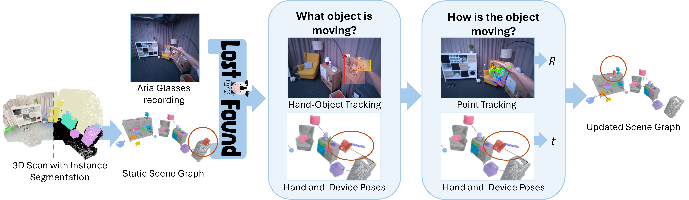

<div align='center'>
<h2 align="center"> Lost & Found: Tracking Changes from Egocentric Observations in 3D Dynamic Scene Graphs </h2>

<div class="is-size-5 publication-authors">
    <span class="author-block">
        <a href="https://www.linkedin.com/in/tjark-behrens">Tjark Behrens</a><sup>1</sup>,</span>
    <span class="author-block">
        <a href="https://renezurbruegg.github.io/">René Zurbrügg</a><sup>1</sup>,</span>
    <span class="author-block">
        <a href="https://people.inf.ethz.ch/marc.pollefeys/">Marc Pollefeys</a><sup>1,2</sup>,
    </span>
    <span class="author-block">
        <a href="https://zuriabauer.com/">Zuria Bauer</a><sup>1,*</sup>,
    </span>
    <span class="author-block">
        <a href="https://hermannblum.net/">Hermann Blum</a><sup>1,3,*</sup>
    </span>
</div>

<div class="is-size-5 publication-authors">
    <span class="author-block"><sup>1</sup>ETH Zürich,</span>
    <span class="author-block"><sup>2</sup>Microsoft,</span>
    <span class="author-block"><sup>3</sup>Uni Bonn</span>
    <span class="author-block">&nbsp;&nbsp;&nbsp;<sup>*</sup>Equal supervision</span>
</div>
<br>



# Abstract

Recent approaches have successfully focused on the segmentation of static reconstructions, thereby equipping downstream applications with semantic 3D understanding. However, the world in which we live is dynamic, characterized by numerous interactions between the environment and humans or robotic agents. Static semantic maps are unable to capture this information, and the naive solution of rescanning the environment after every change is both costly and ineffective in tracking e.g. objects being stored away in drawers. With Lost & Found we present an approach that addresses this limitation. Based solely on egocentric recordings with corresponding hand position and camera pose estimates, we are able to track the 6DoF poses of the moving object within the detected interaction interval. These changes are applied online to a transformable scene graph that captures object-level relations. Compared to state-of-the-art object pose trackers, our approach is more reliable in handling the challenging egocentric viewpoint and the lack of depth information. It outperforms the second-best approach by 34% and 56% for translational and orientational error, respectively, and produces visibly smoother 6DoF object trajectories. In addition, we illustrate how the acquired interaction information in the dynamic scene graph can be employed in the context of robotic applications that would otherwise be unfeasible: We show how our method allows to command a mobile manipulator through teach & repeat, and how information about prior interaction allows a mobile manipulator to retrieve an object hidden in a drawer.


[[Project Webpage](https://behretj.github.io/LostAndFound/)]
[[Paper](https://arxiv.org/abs/2411.19162)]
[[Teaser Video](https://youtu.be/xxMsaBSeMXo)]

</div>

## Environment Setup :memo:

- Setup conda environment

```bash
# create conda environment
conda create -n lost_found -c conda-forge python=3.10.12

# activate conda environment
conda activate lost_found

# install PyTorch for your respective architecture, tested with CUDA 11.7:
conda install pytorch==2.0.1 torchvision==0.15.2 torchaudio==2.0.2 pytorch-cuda=11.7 -c pytorch -c nvidia

# install and build dependencies for co-tracker
cd thirdparty/cotracker && pip install -e . && cd ../..

# install and build dependencies for hand-object-detector
cd thirdparty/detector/lib && python setup.py build develop && cd ../../..

# Install remaining dependencies in main repository
pip install -r requirements.txt
```

If problems arise with the thirdparty modules on your machine, have a look at the respective git repositories for more detailed installation guides: [co-tracker](https://github.com/facebookresearch/co-tracker) and [hand-object-detector](https://github.com/ddshan/hand_object_detector).


## Downloads :droplet:

1) The pre-trained model weights for the hand-object detection are available [here](https://drive.google.com/open?id=1H2tWsZkS7tDF8q1-jdjx6V9XrK25EDbE) and place them under the folder `thirdparty/detector/models/res101_handobj_100K/pascal_voc`:
    
    ```bash
    mkdir -p thirdparty/detector/models/res101_handobj_100K/pascal_voc
    cd thirdparty/detector/models/res101_handobj_100K/pascal_voc
    gdown https://drive.google.com/uc?id=1H2tWsZkS7tDF8q1-jdjx6V9XrK25EDbE
    cd ../../../../..
    ```

1) The pre-trained CoTracker2 weights for the online version is available [here](https://huggingface.co/facebook/cotracker/resolve/main/cotracker2.pth) and place them under the folder `thirdparty/cotracker/checkpoint`:

    ```bash
    mkdir thirdparty/cotracker/checkpoint
    cd thirdparty/cotracker/checkpoint
    wget https://huggingface.co/facebook/cotracker/resolve/main/cotracker2.pth
    cd ../../..
    ```

1) [Optional] Download [demo data](TODO) and extract them under the folder `demo_data/` as well as the respective [3D Scan](TODO) for the demo under the folder `Scan/`. (Coming Soon!)

1) [Optional] Download the full [Evaluation Dataset](TODO) and extract them under the folder `Dataset/`. Download the [3D Scan](TODO) for the evaluation under the folder `Scan/` if not done so in the previous step already. (Coming Soon!)

1) [Optional] There is an easy docker setup available for the YOLO drawer detection algorithm. Simply pull the docker image from the hub (`docker pull craiden/yolodrawer:v1.0`). Start the container (`docker run -p 5004:5004 --gpus all -it craiden/yolodrawer:v1.0`) and run the module (`python3 app.py`). You need to activate the respective flag for drawer detection in the `preprocess_scan` function and in the `build` of the respective scene graph as mentioned in the demo section below. The functional elements for light switches are included in this repo as well. For the setup of the detection module, we refer to [this work](https://github.com/timengelbracht/Spot-Light). They also greatly demonstrate how robotic agents profit from the proposed scene graph structure in the case of light switches.

## Run demo

If you have not downloaded the demo data yet as well as the detecion modules, do so as described in the section above. The file `run_demo.py` consists of an example that steps through the different possibilities when creating a scene graph for ttat tracking
sequence. Fill in the respective directories for the variables `SCAN_DIR` and `ARIA_DATA` at the beginning of the file.

In the `preprocess_scan`, we have the option whether we want to run an additional drawer- or light switch-detection algorithm on the scan. If we have done so, we can integrate those detections into the scene graph within its build function.

When creating the scene graph, we have the possibility to set a minimum confidence threshold for objects that should be added to the graph as well as a list of objects that we would like to mark as immovable throughout the tracking. The `remove_category` function proves useful when you want to get rid off certain object categories for better visualization. To actually visualize the graph, it's
sufficient to call the corresponding `visualize()` function. The flags `centroid`, `connections` and `labels` toggle the visibility of these within the scene graph. For tracking, one can choose to create a video of the sequence by providing a corresponding path.

```bash
python run_demo.py 
```

## Evaluation/Dataset

In this section, we report the results of our paper. To reproduce the results, download the dataset as mention above and place it inside
an appropriate location. With the two commands below, you are able to generate the 6DoF trajectories with corresponding timesteps for
(i) the Head Pose baseline and (ii) Lost & Found:

```bash
# (i): Head Pose
python run_dataset.py --scan_dir Data/Final_Scan --data_dir Data/Final_Dataset --headpose --save_pose

# (ii): Lost & Found
python run_dataset.py --scan_dir Data/Final_Scan --data_dir Data/Final_Dataset --save_pose
```

We used custom implementations of [BundleTrack](https://github.com/wenbowen123/BundleTrack), [BundleSDF](https://github.com/NVlabs/BundleSDF) and [FoundationPose](https://github.com/NVlabs/FoundationPose) for baseline comparison, in a sense that we introduced [Metric3Dv2](https://github.com/YvanYin/Metric3D) for depth and [SAM2](https://github.com/facebookresearch/sam2) for mask generation. Please refer to the code bases for more detailed information.

We state the main findings of our approach compared to the baselines below. For more, information please refer to the actual [paper](TODO:link).


## Run Pipeline on your own data

This setup requires access to Aria glasses as part of the Aria Research Kit (ARK).

### 3D Scan

To run the pipeline on your own data, you require an initial 3D scan. In the scope of this project, we use the [3D Scanner App](https://3dscannerapp.com/) on iOS to capture the scene.
Make sure the fiducial is visible during the scan for initialization.
Once the scan is complete, click on `Share` and export two things:

1. `All Data` contains a 3D mesh of the scene as well as all RGB images along with the camera poses for reconstruction.
2. `Point Cloud/PLY` with the `High Density` setting enabled (keep the default of `Z axis up` **disabled**!).

Rename the point cloud to `mesh.ply` and place it within the extracted `All Data` folder and give the folder a meaningful name. The folder should have the following structure:

```
Scan/
├── annotations.json
├── export.obj
├── export_refined.obj
├── frame_00000.jpg
├── frame_00000.json
├── ...
├── info.json
├── mesh.ply
├── textured_output.jpg
├── textured_output.mtl
├── textured_output.obj
├── thumb_00000.jpg                
└── world_map.arkit
```

### Mask3D

An initial semantic instance segmentation of the scene is required. As explained in the paper, we stick to [Mask3D](https://github.com/JonasSchult/Mask3D) for this purpose. The setup is involved, hence, we cleanly separate it from the main project and use a provided docker container for easy installation (Credits to Rupal Saxena). This is reasonable as we need to perform the instance segmentation only once per scene. For setup without docker, refer to the original repository.

```bash
# clone this forked repository on your machine to a location $MASK3D_DIR
git clone https://github.com/behretj/Mask3D.git

# Download the model weights to the checkpoints folder
cd mask3d/checkpoints && wget "https://zenodo.org/records/10422707/files/mask3d_scannet200_demo.ckpt" && cd ..

# pull the docker image
docker pull rupalsaxena/mask3d_docker:latest

# Run the docker container and mount the folder of your Mask3D repository
docker run --gpus all -it -v $HOME:/home -w $MASK3D_DIR/Mask3D rupalsaxena/mask3d_docker:latest

# Inside the docker container, run the following command with the workspace set to the 3D Scan directory ($SCAN) from the previous section
python mask3d.py --seed 42 --workspace $SCAN

# You might face permission issues later on, so allowing general access to the folder at this point is useful:
chmod -R 777 $SCAN
```

The scan directory consists now of an extra labeled point cloud and corresponding predictions in addition to the prior content:

```
Scan/
├── pred_mask/
│   ├── 000.txt
│   ├── ...
├── ...         
├── mesh_labeled.ply
└── predictions.txt
```

### Aria Recording

Data should be collected in recording [profile 15](https://facebookresearch.github.io/projectaria_tools/docs/tech_spec/recording_profiles#recording-profile-specs) with the Aria glasses, capturing RGB videos with 30 FPS at a resolution of 1408x1408 pixels. Similarly to the initial 3D scan, the fidicual marker needs to be visible once during the recording. Each recording produces two files, rename both of them with the same meaningful name. All the recordings from one scene should be placed in the same folder for easier processing.

```
Data/
├── {recording_1}.vrs
├── {recording_1}.vrs.json
├── ...         
├── {recording_n}.vrs
└── {recording_n}.vrs.json
```

Calling `preprocessing.sh Data/` and entering user name and passsword when prompted requests the Machine Perception Services offered within the Meta API. Make sure that you run the script within the environment you set up for this project. This generates folders with sparse point clouds, device poses and estimated hand positions.

### Object tracking and Pose estimation

After setting the correct paths at the top of the file, you can start the tracking process: `python run_custom.py`. The different visualization options as well as the YOLO extension module work in the same way as explained in the [demo section](#run-demo).


## Citing Lost & Found

```
@ARTICLE{LostFoundBehrens,
    author={Behrens, Tjark and Zurbrügg, René and Pollefeys, Marc and Bauer, Zuria and Blum, Hermann},
    journal={IEEE Robotics and Automation Letters}, 
    title={{Lost & Found}: Tracking Changes from Egocentric Observations in 3D Dynamic Scene Graphs}, 
    year={2025},
    volume={},
    number={},
    pages={1-8},
    keywords={Visual Tracking;Mapping;Semantic Scene Understanding},
    doi={10.1109/LRA.2025.3544518}
}
```
